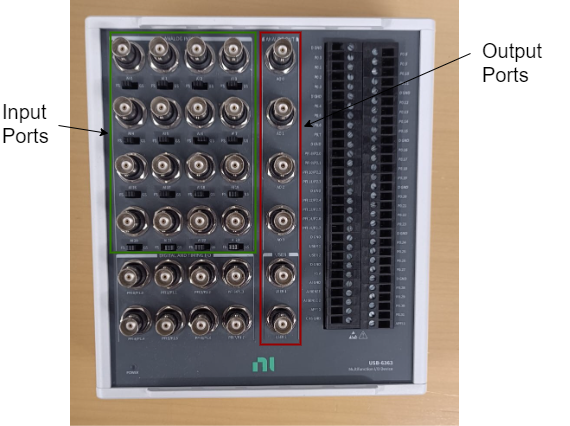
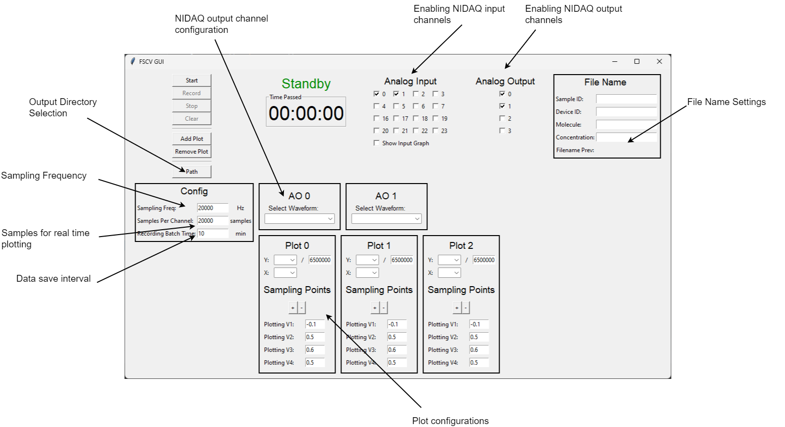
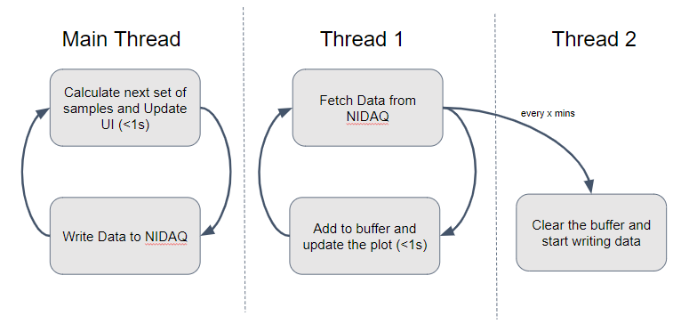

# NIDAQ Python Interface

A NIDAQ Python interface is an essential tool for facilitating data acquisition and analysis using National Instruments Data Acquisition (NIDAQ) hardware within the Python programming environment. This interface provides users with additional flexibility for measuring, plotting, and processing data obtained from NIDAQ devices.

By leveraging the power of Python, users can seamlessly integrate NIDAQ functionality into their data acquisition workflows, allowing for efficient control of input and output channels, data acquisition settings, and real-time monitoring of acquired signals. Additionally, the Python interface enables users to implement advanced data processing algorithms, perform complex signal analysis, and visualize results with ease.

The NIDAQ Python interface abstracts low-level hardware interactions, providing a user-friendly API that simplifies the development of data acquisition applications. With features such as multithreading support, asynchronous data acquisition, and seamless integration with popular Python libraries for scientific computing and visualization, the interface empowers users to efficiently capture, analyze, and interpret data from NIDAQ devices for a wide range of research, industrial, and academic applications.

## NIDAQ Overview

The National Instruments Data Acquisition (NIDAQ) system is a robust hardware and software platform designed for acquiring, analyzing, and visualizing data from various sources. It offers high-performance data acquisition capabilities suitable for a wide range of applications in research, industrial automation, and testing.

## Threading in Python

Threading in Python refers to the ability of the Python interpreter to run multiple threads simultaneously. This is particularly useful when dealing with tasks that can benefit from parallel execution, such as interfacing with external hardware like NIDAQ while keeping the main application responsive.

## Interface Design

The requirements for the interface design include the capability for real-time plotting of data, providing users with immediate visual feedback. Additionally, the interface should offer options for generating various waveforms, such as N-wave or triangular waveforms, and the flexibility to stream data from external files to any of the NIDAQ output channels. Seamless interaction with the user is also essential, ensuring a smooth and intuitive experience when configuring settings and initiating data acquisition processes. However, the most critical requirement is the ability to record data continuously for extended periods while maintaining a high sampling rate, ensuring accurate and detailed data capture for long-term experiments or monitoring tasks. Keeping all this in mind, the designed NIDAQ interface is as shown in Figure 63.

Seamless operation is crucial for the interface. The process of writing to and reading from the NIDAQ should not interfere with each other to ensure smooth and uninterrupted data acquisition and analysis. The details of how this is implemented will be discussed in the following sections.

### Writing to NIDAQ

Writing data to the NIDAQ system involves configuring the desired output channels and sending data to be outputted. This process typically includes setting parameters such as sampling rate, voltage range, and triggering options. The writing runs on the main thread as that of the UI. The configuration of the GUI is extracted and processed accordingly. Samples for the output waveform are generated for a single period and then configured to the nidaqmax write object. It automatically repeats the samples again and again until the user clicks stop.

### Reading from NIDAQ

Reading data from the NIDAQ system involves configuring input channels and acquiring data from these channels. This process entails continuous streaming of data when the user presses the start button. To integrate this seamlessly with writing operations, the multithreading feature discussed in Section ?? is utilized. The read thread operates independently in a separate thread from the main thread. This ensures that the graphical user interface (GUI) remains responsive, even when the program is awaiting the next set of samples from the NIDAQ. Samples are fetched every 1 second and plotted according to the configuration set in the GUI by the user. It’s crucial to fetch at least Fs (sampling frequency) number of samples from the NIDAQ buffer every 1 second; otherwise, the buffer will eventually run out of space, triggering an error from the NIDAQ. After fetching Fs samples, the read thread plots the data. It’s important that the plotting process takes less than 1 second, allowing the thread sufficient time to fetch the next Fs samples to prevent accumulation in the buffer.

### Plotting Data

Once data has been acquired from the NIDAQ system, it can be visualized using Matplotlib. Plotting allows for the analysis and interpretation of the acquired data, enabling insights into the underlying processes being measured. Instead of plotting the entire samples fetched in a second, the program plots the number of samples specified in the 'Samples per Channel' box. This ensures that in the case of a high sampling rate, one can plot only the relevant number of samples, thereby preventing lagging in the program and improving overall efficiency.

### Recording Data

Recording the data is a crucial step to be implemented in the interface. The TDMS file format is used to store the data as it can accommodate an unlimited number of rows and occupies less space. One of the problems encountered while recording data for a long time is that the RAM gets capped out due to the high sampling rate and long period of data collection. To overcome this, instead of writing data to a file at the end, data is written every x minutes as separate files. The write interval can be set by changing the “Recording Batch Time” field in the GUI, with a default of 10 minutes provided. This means that if the user starts recording, the data will be written as a TDMS file every 10 minutes, clearing the buffer and releasing the RAM. In this way, the user can record data as long as the computer does not run out of hard disk space.

Writing the data to a TDMS file takes a while, and it’s crucial that the reading thread does not stall during this process. To address this, when it’s time to write, a copy of the data buffer is created and sent to a new thread for writing to a TDMS file. This allows the reading thread to continue its operations without interruption. Once the writing thread has started, the reading thread clears its buffer and resumes fetching and plotting the received data. This ensures seamless operation without any delay in data acquisition and visualization.

The entire process is summarized in Figure 64.

## Conclusion

In conclusion, the NIDAQ Python interface presented here offers a comprehensive solution for efficient data acquisition and analysis using National Instruments Data Acquisition hardware within the Python environment. By leveraging the capabilities of Python, users can seamlessly integrate NIDAQ functionality into their workflows, allowing for real-time monitoring, waveform generation, and data recording. The interface’s design prioritizes user interaction, ensuring smooth operation and intuitive control. Multithreading is employed to prevent interruptions during data acquisition and visualization, enabling continuous streaming and plotting of acquired data. Additionally, the implementation of data recording batches mitigates issues related to RAM usage during prolonged data collection sessions.

Overall, this interface provides a robust and flexible platform for a wide range of research, industrial, and academic applications, empowering users to efficiently capture, analyze, and interpret data from NIDAQ devices.
